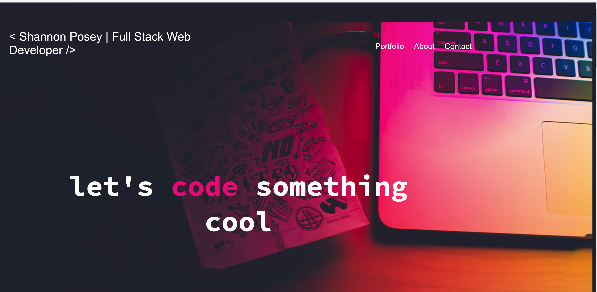

# My Portfolio

<<<<<<< HEAD
## This portfolio is to showcase my work to potential employers.
=======
> Display of work using HTML, CSS, and JavaScript
>>>>>>> d1a1a12559df5c7d45c25a8c046967d25c9774c6

### Description
I created this portfolio to show the scope of skills set that I am currently learning.  

<<<<<<< HEAD
### Built With
HTML
CSS

### Website
https://shannonposey.github.io/my-portfolio/

### Contribution

Made by Shannon Posey
=======

## Author

👤 **Shannon Posey**

* Github: [@ShannonPosey](https://github.com/ShannonPosey)
* LinkedIn: [@https:\/\/www.linkedin.com\/in\/shannonposey](https://linkedin.com/in/https:\/\/www.linkedin.com\/in\/shannonposey)

## 🤝 Contributing

Contributions, issues and feature requests are welcome! Feel free to check [issues page]. You can also take a look at the [contributing guide].

## Show your support

Give a ⭐️ if this project helped you!

## 📝 License

Copyright © 2021 [Shannon Posey](https://github.com/ShannonPosey). 

***
_This README was generated with ❤️ by [readme-md-generator](https://github.com/kefranabg/readme-md-generator)_
>>>>>>> d1a1a12559df5c7d45c25a8c046967d25c9774c6
